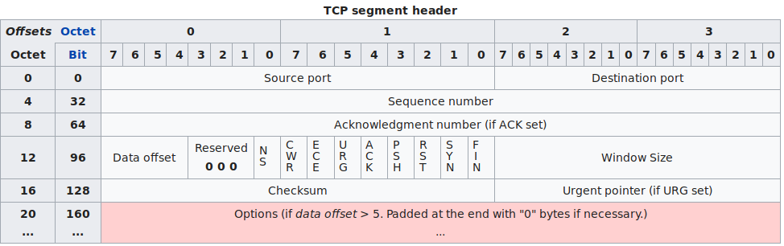

<!-- tcp-header -->
## TCP Header

Practice the use of bit-wise operations in C by implementing the TCP protocol packet header structure according to this [*definition*](https://en.wikipedia.org/wiki/Transmission_Control_Protocol#TCP_segment_structure), where each line of the header represents a 4-byte section of the structure, i.e. 32 bits or 4 octets. The octets are counted from the left top corner, this way every field of the header is defined. For instance, if we are storing the bytes on the table ``tcp_hdr`` and we want to extract the *Window Size* field, then we should combine the elements ``tcp_hdr[14]`` and ``tcp_hdr[15]``.


(Image from Wikipedia)

>**Note**: Implementations of the functions that perform the bit-wise operations are written in [``bits.c``](bits.c). While the implementation of the functions that perform the fields extraction from the TCP header are written in [``tcpheader.c``](tcpheader.c).


### bits.c

Following the functions implemented in this file:

>Definitions of the functions that perform the bit-wise operations are defined in [``bits.h``](bits.h).

- **op_bit_set**:
```C
void op_bit_set(unsigned char* data, int i)
```
Sets the given bit of the position ``i``, i.e. turns its value into '1'.

- **op_bit_unset**:
```C
void op_bit_unset(unsigned char* data, int i)
```
Unsets the given bit of the position ``i``, i.e. turns its value into '0'.

- **op_bit_get**:
```C
int op_bit_get(const unsigned char* data, int i)
```
Returns the current value of the bit, i.e. this function will return either '1' or '0'.

- **op_print_byte**:
```C
void op_print_byte(unsigned char b)
```
Prints one unsigned char as a binary representation.

- **op_bit_get_sequence**:
```C
unsigned char op_bit_get_sequence(const unsigned char* data, int i, int how_many)
```
Separates a maximum of 8 bits from a long binary number table and returns it. The bits are read to the right of the given index. ``data`` and ``i`` work as above, ``how_many`` indicates how many bits of string to return (max. 8).

- **op_print_byte**:
```C
void op_print_byte(unsigned char b)
```
Prints one unsigned char as a binary representation.

>**Note**: In this implementation, the most sigficant bit is the bit in the position '0', i.e. the leftmost bit.


### tcpheader.c

In this file the functions to extract the TCP header fields are implemented. In addition, the corresponding 'setters' functions are also implemented:

- **getSourcePort** 
```C
int getSourcePort(const unsigned char *tcp_hdr)
```
Returns the source port.

- **getSourcePort** 
```C
int getDestinationPort(const unsigned char *tcp_hdr)
```
Returns the destination port.

- **getAckFlag** 
```C
int getAckFlag(const unsigned char *tcp_hdr)
```
Returns the value of the ACK flag (0 or 1).

- **getDataOffset** 
```C
int getDataOffset(const unsigned char *tcp_hdr)
```
Returns the data offset.

- **setSourcePort** 
```C
void setSourcePort(unsigned char *tcp_hdr, int port)
```
Sets the source port field as indicated by the ``port`` parameter.

- **setDestinationPort** 
```C
void setDestinationPort(unsigned char *tcp_hdr, int port)
```
Sets the destination port field as indicated by the ``port`` parameter.

- **setAckFlag** 
```C
void setAckFlag(unsigned char *tcp_hdr, int flag)
```
Sets the ACK flag field as indicated by the ``flag`` parameter.

- **setDataOffset** 
```C
void setDataOffset(unsigned char *tcp_hdr, int offset)
```
Sets the Data Offset field as indicated by the ``offset`` parameter.


### Running the program

Execute the following:
```bash
gcc -o main main.c tcpheader.c bits.c -Wvla -Wall -g -std=c99 -lm
./main
```
>**Note**: We need to add the flag ``-lm`` to the compilation command because we are using the ``<math.h>`` library and it needs to be linked.